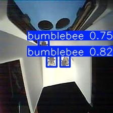

[supported]: https://img.shields.io/badge/-supported-green "supported"

| Chip     | ESP-IDF v5.3           | ESP-IDF v5.4           |
|----------|------------------------|------------------------|
| ESP32-S3 | ![alt text][supported] | ![alt text][supported] |
| ESP32-P4 | ![alt text][supported] | ![alt text][supported] |

# Bumblebee Detect Example

A simple image inference example. In this example, we use ``bumblebee.jpg`` for test. With default setting(iou=0.7, conf=0.6), the detection result before quantization is shown below:



## Quick start

Follow the [quick start](https://docs.espressif.com/projects/esp-dl/en/latest/getting_started/readme.html#quick-start) to flash the example, you will see the output in idf monitor:

```
I (1637) bumblebee_detect: [category: 0, score: 0.880797, x1: 265, y1: 110, x2: 471, y2: 388]
I (1647) main_task: Returned from app_main()
```

## Configurable Options in Menuconfig

### Component configuration
We provide the models as components, each of them has some configurable options.

### Project configuration

- CONFIG_PARTITION_TABLE_CUSTOM_FILENAME

If model location is set to FLASH partition, please set this option to `partitions2.csv`

---

## Deploy

cd c:\Users\nilsg\repos\esp-dl\examples\bumblebee_detect\

idf.py set-target esp32s3

idf.py build

idf.py -p COM3 flash monitor